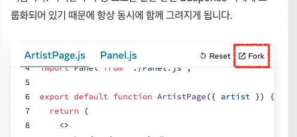

# Suspense

## 목차

- [Suspense](#suspense)
  - [목차](#목차)
  - [레퍼런스](#레퍼런스)
    - [주의사항](#주의사항)
  - [사용법](#사용법)
    - [콘텐츠가 로드되는 동안 대체 UI 보여주기](#콘텐츠가-로드되는-동안-대체-ui-보여주기)
    - [콘텐츠를 한꺼번에 함께 보여주기](#콘텐츠를-한꺼번에-함께-보여주기)
    - [서버 에러 및 서버 전용 콘텐츠에 대한 Fallback 제공](#서버-에러-및-서버-전용-콘텐츠에-대한-fallback-제공)

## 레퍼런스

### 주의사항

1. [아키텍처 개요](https://github.com/reactwg/react-18/discussions/37)를 읽고 [기술 강연](https://www.youtube.com/watch?v=pj5N-Khihgc)을 시청하여 더 자세히 알아보세요.
   - 이번주는 읽을 거리가 정말 많네요 ㅎㅎ 그래도 영상 길이가 약 18분이고 영자막도 있어서 출근할 때 시도를 해볼까 고민중입니다

## 사용법

### 콘텐츠가 로드되는 동안 대체 UI 보여주기

1. [Relay](https://relay.dev/docs/guided-tour/rendering/loading-states/)와 [Next.js](https://nextjs.org/docs/app/building-your-application/rendering) 같이 Suspense가 가능한 프레임워크를 사용한 데이터 가져오기
   - 좀 더 Suspense랑 관련된 Next.js 페이지를 찾아서 공유합니다!  
     [https://nextjs.org/docs/app/building-your-application/routing/loading-ui-and-streaming](https://nextjs.org/docs/app/building-your-application/routing/loading-ui-and-streaming)
2. 독단적인 프레임워크를 사용하지 않는 Suspense가 가능한 데이터 불러오기 기능은 아직 지원되지 않습니다.

   - 이게 무슨 말인가 싶어서 간단히 검색을 해봤는데요..
     > But how exactly does React know that a network call is pending? As far as we’ve reviewed, Suspense only renders a fallback component while waiting. Where in the code do we communicate to React that we’re making a network call?
     >
     > This is where the data fetching libraries come in. Currently, Relay and SWR have integrations with Suspense to communicate loading states to React. I imagine more library authors will add integrations in the future.
     >
     > 이처럼 아직까진 Relay나 SWR 같은 라이브러리 없이 suspense로 fallback을 보여주고.. 이런건 안된다는 뜻인가봐요  
     > (출처: [https://blog.logrocket.com/data-fetching-react-suspense/](https://blog.logrocket.com/data-fetching-react-suspense/) )
   - 그리고 '독단적인 프레임워크' (원문에서는 opinionated framework) 라는 단어도 잘 이해가 되지 않아서 챗지피티한테 물어보니 이렇다고 하네요

     > In the context of software development, an "opinionated framework" refers to a framework or tool that enforces a specific set of conventions, patterns, and best practices, often with the goal of making development easier and more productive.

   - 저는 이 부분을 이렇게 이해했는데 참고가 될까 싶어 달아둬요!!
     1. UI 컴포넌트의 렌더링 여부는 감지하여 Suspense를 적용할 수 있음
     2. 하지만 데이터의 로딩에 대한 Suspense는 아직 지원되지 않음 (필요하다면 기타 라이브러리 사용이 필요함)
   - **[A/S]** 1번 케이스의 경우 react만으로 suspense 사용이 가능하다고 생각했던 사례가 있었는데, 스터디 후 코드를 다시 찾아보니 React-query에서 지원하는 suspense 옵션을 사용하고 있었네요.. 😅 현재 react만으로 suspense를 사용하는 방법은 없는 것 같습니다.

     참고가 될 만한 링크 달아두고 가요!  
      [https://tech.kakaopay.com/post/react-query-2/](https://tech.kakaopay.com/post/react-query-2/)

3. 데이터 소스를 Suspense와 통합하기 위한 공식 API는 향후 React 버전에서 출시될 예정입니다.
   - 이것도 계획은 있나보군요. 👀 외부 라이브러리 의존적인 리액트 생태계에서, 라이프 사이클에 핵심적인 영향을 미치는 부분을 내재화하려는 방향성은 긍정적이라고 생각합니다
   - 이거 어제 공부한 use 훅이라고 생각합니다! 아직 카나리 버전이지만 내년에는 출시되지 않을지
   - 아하 그러게요 use를 의미하는 걸수도 있겠네요!

### 콘텐츠를 한꺼번에 함께 보여주기

1. 기본적으로 Suspense 내부의 전체 트리는 하나의 단위로 취급됩니다. 예를 들어, 이러한 구성 요소 중 하나라도 어떤 데이터에 의해 지연되더라도 모든 구성 요소가 함께 로딩 표시로 대체됩니다.
   - 데이터를 각각 다른 API로 가져오면 화면 상에서 싱크가 안 맞는 경우가 있을텐데 그럴 때 유용할 것 같습니다
2. `Fork`  
   
   - 오 여기 코드 fork 해보니까 use를 사용한 예제가 나옵니다. import한 건 아니고 어제 공부한 use 훅이 정식으로 출시되기 전이라 비슷하게 구현해 둔 것 같습니다.

### 서버 에러 및 서버 전용 콘텐츠에 대한 Fallback 제공

1. [스트리밍 서버 렌더링 API](https://ko.react.dev/reference/react-dom/server)

   - [스트리밍 서버 렌더링](https://patterns-dev-kr.github.io/rendering-patterns/streaming-server-side-rendering/) 지난 번에 소개했던 패턴 데브에 있는 내용입니다.

     리액트가 스트리밍 서버 렌더링을 지원하기 위해 renderToNodeStream, renderToStrictNodeStream을 제공하고 있다고 소개하고 있는데 자세한 사용 방법과 결과는 저도 시도해 보지 않아서 잘 모르겠네요.. (사이트 내에서 샌드박스를 제공하고 있긴 한데 결과물이 뜨지 않는 상태입니다.. ㅠ)
